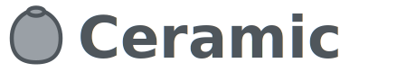

<picture>
  <source media="(prefers-color-scheme: dark)" srcset="doc/assets/logo.svg">
  
</picture>

Ceramic is a programming language based on Clay designed for Generic Programming.

## License

Original BSD code: see LICENSE.txt  
My contributions: licensed under GNU GPLv2
